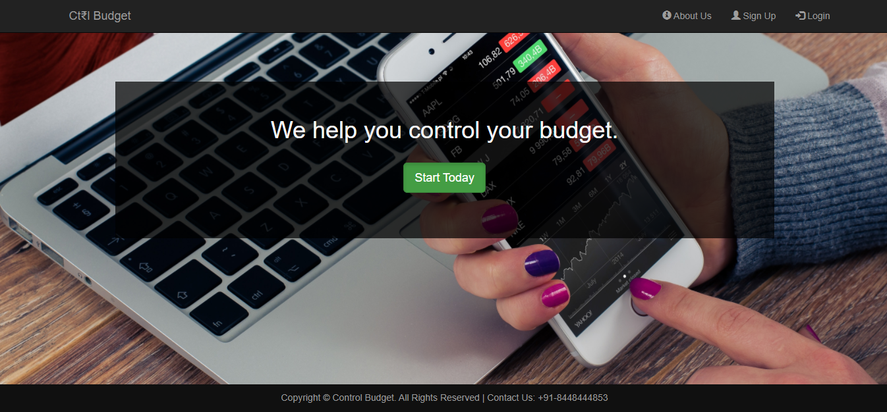
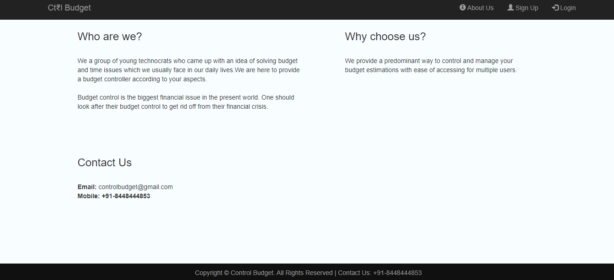
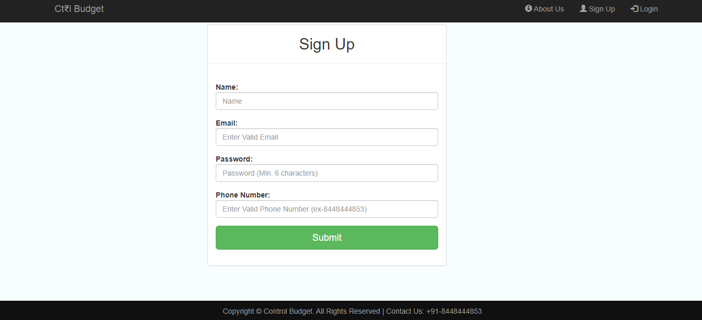
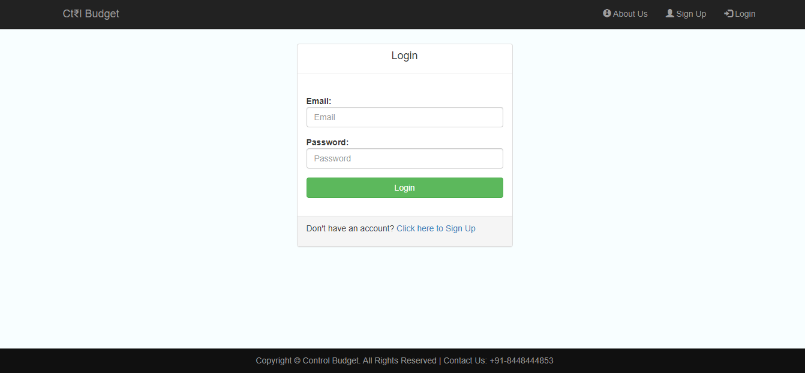
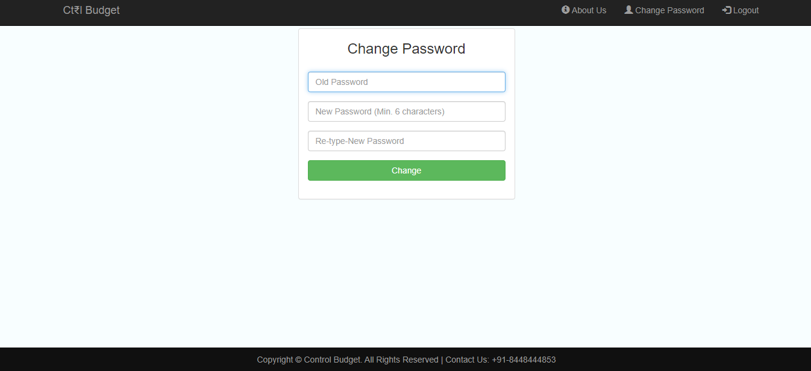
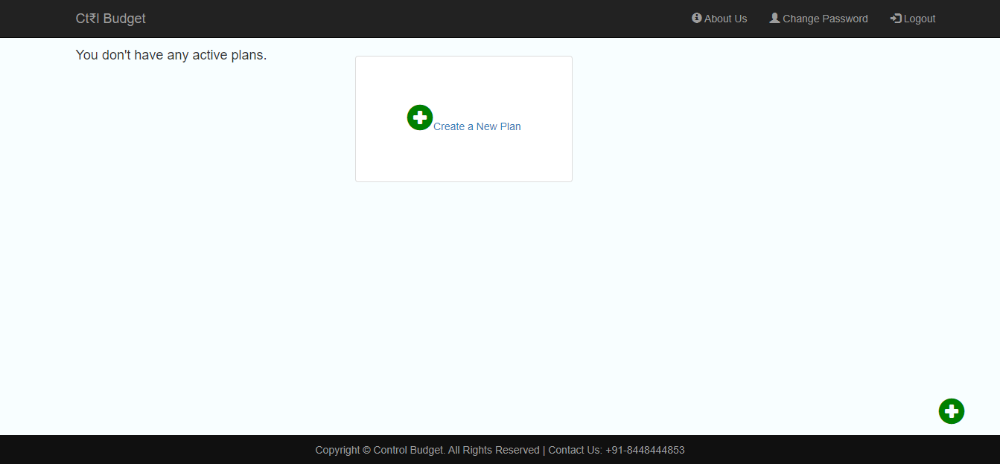
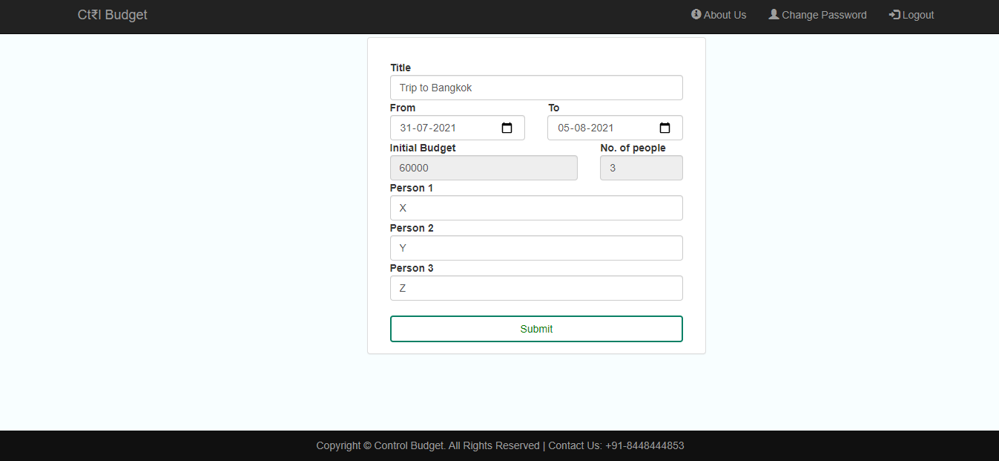
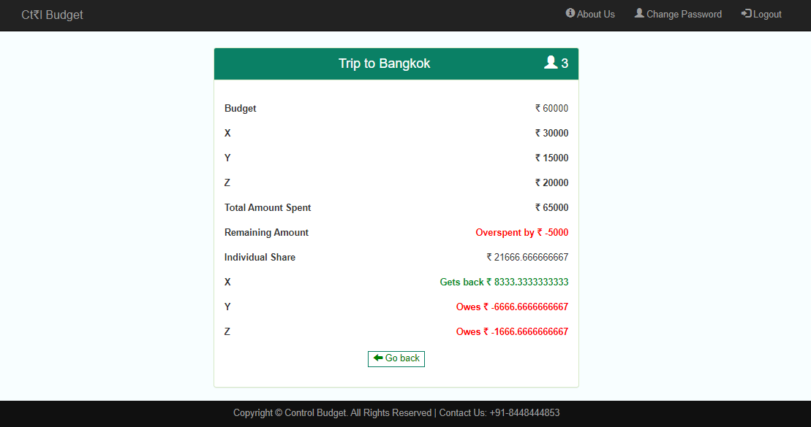
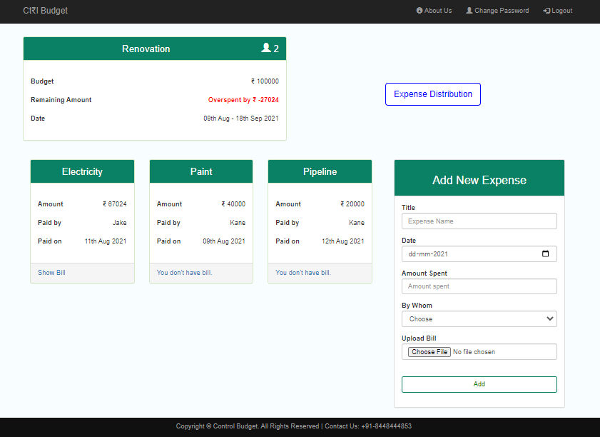
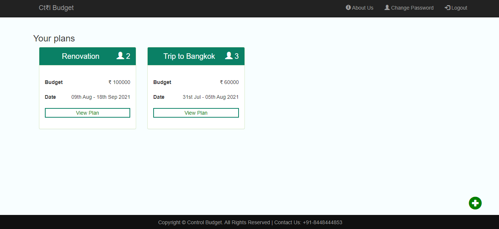

# Expense Manager

- A basic expense manager that can track an user’s expense. 
- The user can add the initial budget for the expenses and give it a title. 
- Further, the user can add bills under the given budget and track her expenses accordingly.

<br>

## Installation

 Download [WampServer](https://www.wampserver.com/en/).

<br>

## Let's Get Started

- Extract the contents of the folder to C:/wamp/www/             
- Go to C:/wamp64/www/Expense Manager. 
- Inside the database folder, there is a 'budget.sql' file.
- Start the WAMP server. Make sure all its services are running and the icon is green in color.
- Open desired browser and go to localhost/Expense Manager.

<br>

## Creating the Server

- To start WampServer, click on WampServer shortcut, this will executes some command prompt and will close automatically.
- Open the browser and type `localhost`. Default WampServer page will open.
- To open the database in WampServer, click on `phpmyadmin` which appears at the bottom left side of the page.
- Default `username` = `root` and password is `blank`.
- phpmyadmin will open. This helps us to create database, add tables and run other SQL queries.

<br>

## Creating the Database

- Click on `new` to create a new database with name = `budget`.
- A new database is created with the name `budget`. Now, click on it.
- Click on `import` option and select the `budget.sql` file present in the folder and then click on `Go`.
- You have successfully created the `budget` database.

<br>

## Usage

1. Landing Page
    - Contains the home page of the website. 
    - User can use `Login` or `Sign Up` button to create an account or login into an account.
    - `About Us` button shows information about the stakeholders. 
    
    <br>
		
2. About Us Page
    - Contains background about the project and the developers.

    <br>
    
3. Sign Up page 
    - Contains a form to create a new user.
    - On successful creation of new user, a pop-up alert message for successfully registration is generated.

    <br>
  
4. Home Page
    - Provides a button to create a new plan.
    - User can change password using the `Change Password` button and can logout using the `Logout` button.
    
    <br>
	
5. Create New Plan 
    - Contains a form divided into two parts to create a new plan.
    - First part contains two fields, i.e. `initial budget` and the `number of people`.
    - Second part contains the `Name of Plan` and `Date` along with the `names of people`.
	- After submission of this form, a new plan is created and the user is redirected to homepage, where she can create more plans using the `add` button.
  
  <br>
	
6. View Plan page 
		
    - Lists all the expenses created by the users.
	- `Add expense` form which can be used to add more expenses. 
    - New expenses are also added in here.
	- `Expense Distribution` button can be used to divide the expenses amongst the people.
  
  <br>

7. View Distribution page
		
   - Provides a detailed view about the budget, plans, all the expenses and who needs to pay back how much to whom.
   
   <br>
	
8. Change Password page
		
    - Allows the user to change the password.
	- On success, an alert message appears, which says that the password has been changed.

<br>
 
## Running the Project

You can either try signing up or you can login with the dummy credentials as follows:-

```
Email = 'abc@gmail.com';
Password = '123456';
```

<br><br>

## Screenshots























